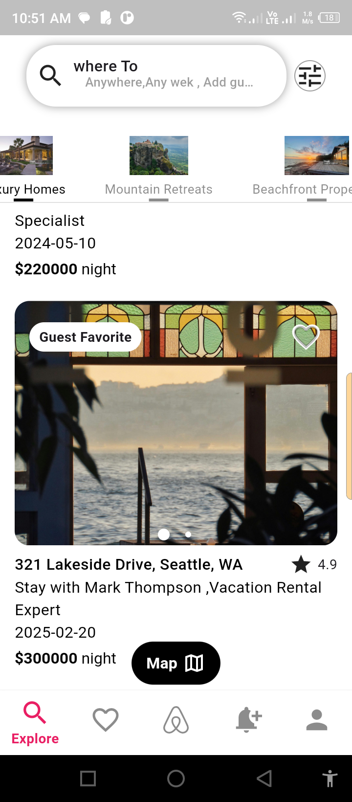
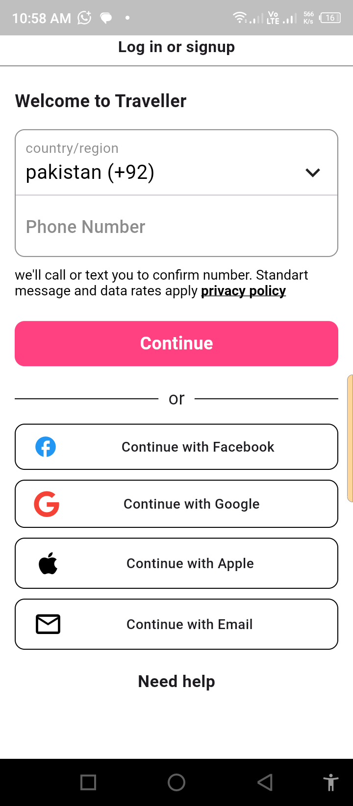
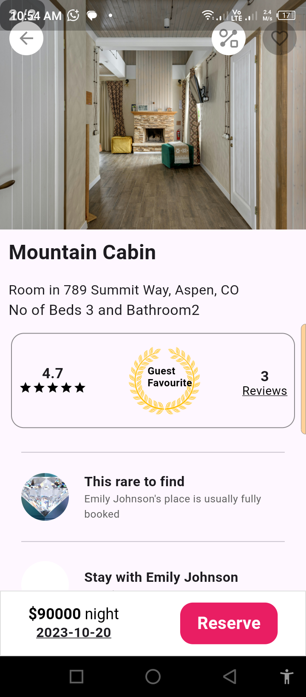
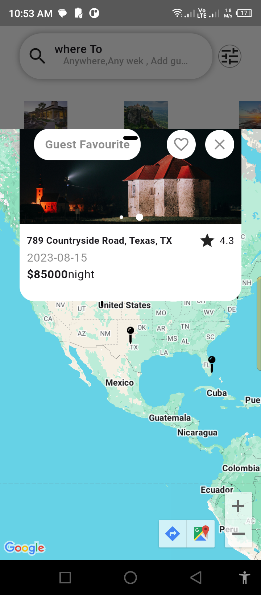
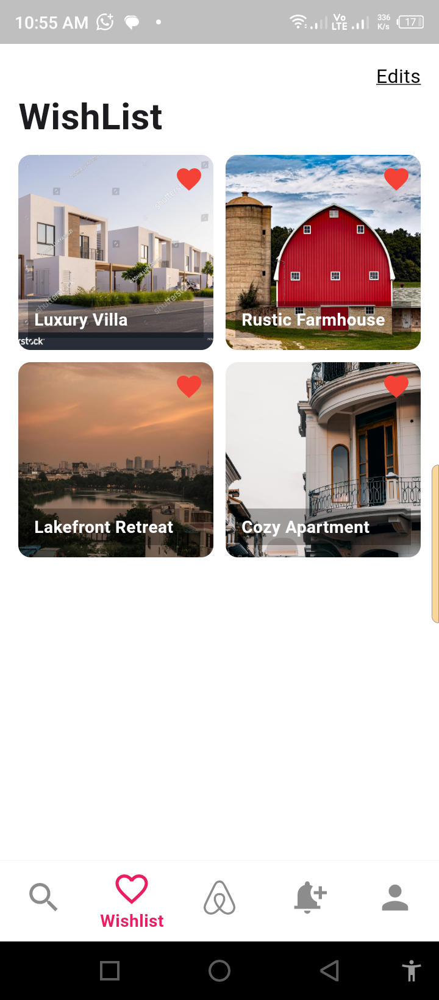
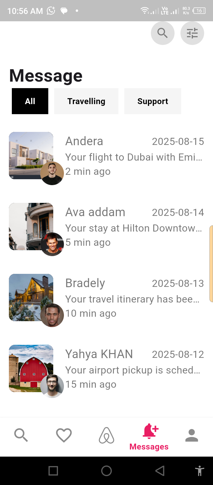
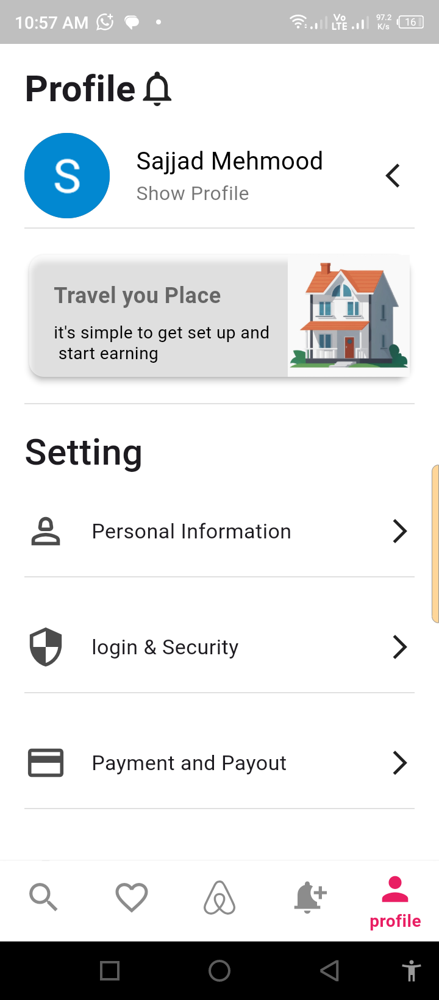

# 🌍 Travel App

[](https://flutter.dev/)
[](https://dart.dev/)
[](https://firebase.google.com/)
[](https://developers.google.com/maps)
[](https://pub.dev/packages/provider)

---

## 📌 Project Description
Travel App is a Flutter-based mobile application designed for travelers to explore destinations worldwide.  
Users can browse destinations, view them on Google Maps, save favorite places, and manage travel preferences.  
The app uses **Firebase** for authentication and data storage, **Google Maps API** for location services, and **Provider** for state management.

---

## ✨ Features
- User authentication with **Firebase** (Sign Up / Log In)
- Browse travel destinations with images and descriptions
- View destinations on **Google Maps**
- Add and manage favorite destinations
- Real-time updates using **Firebase Firestore**
- Smooth and responsive UI with Flutter
- State management using **Provider**

---

## 🖼 Screenshots

<br>
<br>
<br>
<br>
<br>
<br>
<br>
<br>


---

## 🛠 Installation
```bash

1. Clone the repository:

git clone https://github.com/sxjjad-Mehmood/flutter-travel-app-.git 
2.  Navigate to the project folder:

  cd travel-app
3. Install dependencies:
 flutter pub get
4. Run the app on an emulator or connected device:
  flutter run  
  ``` 

---
## 📖 Usage


1. Launch the app on your device or emulator  
2. Sign up or log in using Firebase authentication  
3. Browse travel destinations with images and details  
4. View locations on Google Maps  
5. Add favorite places for quick access  
6. Manage your travel preferences and profile  

---

## 🛠️ Technologies Used


- **Flutter** – Cross-platform mobile app development  
- **Dart** – Programming language for Flutter  
- **Firebase** – Authentication and Firestore database  
- **Google Maps API** – Interactive maps and location display  
- **Provider** – State management for reactive UI  
